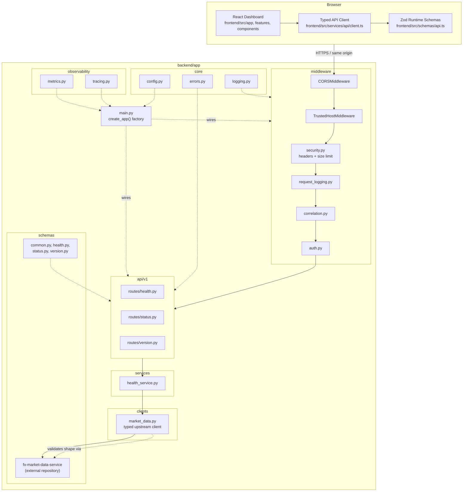
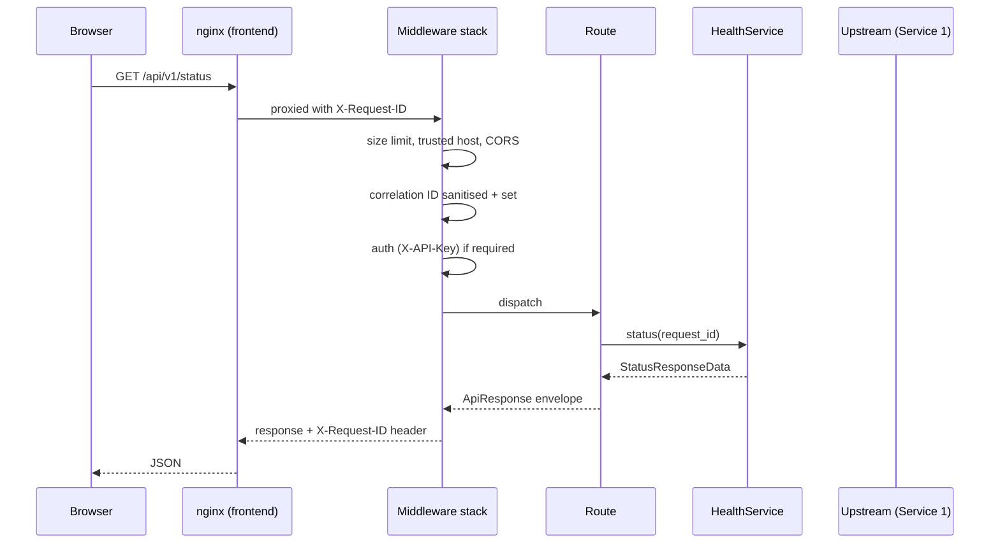
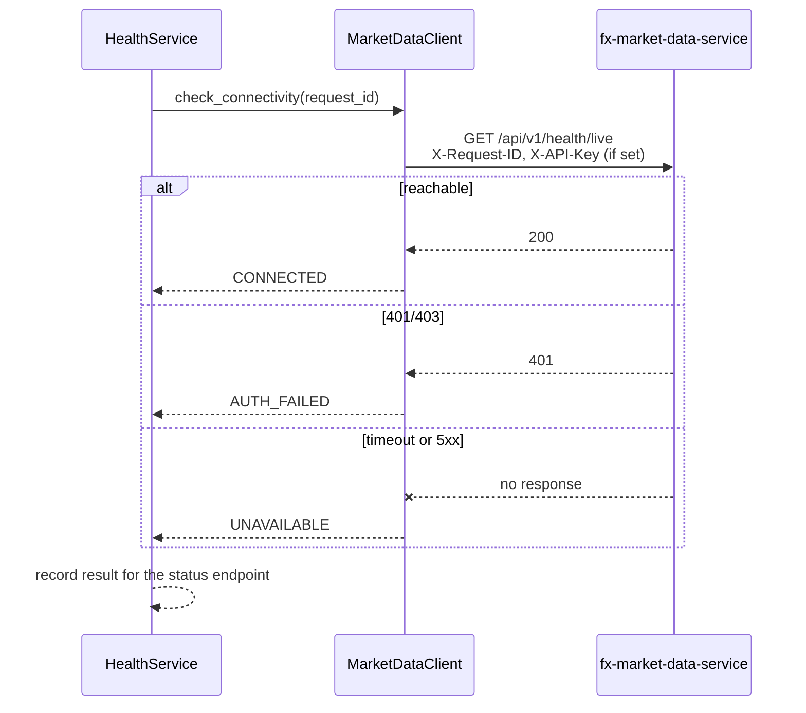

# Component Diagram

A detailed view of the internal structure of
`fx-historical-market-analysis-service`.

```mermaid
graph TB
    subgraph Browser["Browser"]
        UI["React Dashboard<br/>frontend/src/app, features, components"]
        Client["Typed API Client<br/>frontend/src/services/api/client.ts"]
        Zod["Zod Runtime Schemas<br/>frontend/src/schemas/api.ts"]
        UI --> Client
        Client --> Zod
    end

    subgraph Backend["backend/app"]
        subgraph API["api/v1"]
            Health["routes/health.py"]
            Status["routes/status.py"]
            Version["routes/version.py"]
        end

        subgraph Middleware["middleware"]
            SecHdr["security.py<br/>headers + size limit"]
            ReqLog["request_logging.py"]
            Trusted["TrustedHostMiddleware"]
            Cors["CORSMiddleware"]
            Corr["correlation.py"]
            Auth["auth.py"]
        end

        subgraph Core["core"]
            Config["config.py"]
            Errors["errors.py"]
            Log["logging.py"]
        end

        subgraph Services["services"]
            HealthSvc["health_service.py"]
        end

        subgraph Clients["clients"]
            MDC["market_data.py<br/>typed upstream client"]
        end

        subgraph Schemas["schemas"]
            Common["common.py, health.py,<br/>status.py, version.py"]
            Upstream["upstream.py<br/>typed mirror of Service 1"]
        end

        subgraph Obs["observability"]
            Metrics["metrics.py"]
            Tracing["tracing.py"]
        end

        Main["main.py<br/>create_app() factory"]
    end

    Upstream["fx-market-data-service<br/>(external repository)"]

    Browser -->|"HTTPS / same origin"| Cors
    Cors --> Trusted --> SecHdr --> ReqLog --> Corr --> Auth --> API
    API --> HealthSvc
    HealthSvc --> MDC
    MDC --> Upstream
    MDC -. "validates shape via" .-> Upstream
    Main -. "wires" .-> API
    Main -. "wires" .-> Middleware
    Config -.-> Main
    Errors -.-> API
    Log -.-> Middleware
    Metrics -.-> Main
    Tracing -.-> Main
    Common -.-> API
```

## Request flow

```mermaid
sequenceDiagram
    participant B as Browser
    participant N as nginx (frontend)
    participant M as Middleware stack
    participant R as Route
    participant S as HealthService
    participant U as Upstream (Service 1)

    B->>N: GET /api/v1/status
    N->>M: proxied with X-Request-ID
    M->>M: size limit, trusted host, CORS
    M->>M: correlation ID sanitised + set
    M->>M: auth (X-API-Key) if required
    M->>R: dispatch
    R->>S: status(request_id)
    S-->>R: StatusResponseData
    R-->>M: ApiResponse envelope
    M-->>N: response + X-Request-ID header
    N-->>B: JSON
```

## Data flow for the upstream integration

```mermaid
sequenceDiagram
    participant H as HealthService
    participant C as MarketDataClient
    participant U as fx-market-data-service

    H->>C: check_connectivity(request_id)
    C->>U: GET /api/v1/health/live<br/>X-Request-ID, X-API-Key (if set)
    alt reachable
        U-->>C: 200
        C-->>H: CONNECTED
    else 401/403
        U-->>C: 401
        C-->>H: AUTH_FAILED
    else timeout or 5xx
        U--xC: no response
        C-->>H: UNAVAILABLE
    end
    H-->>H: record result for the status endpoint
```
